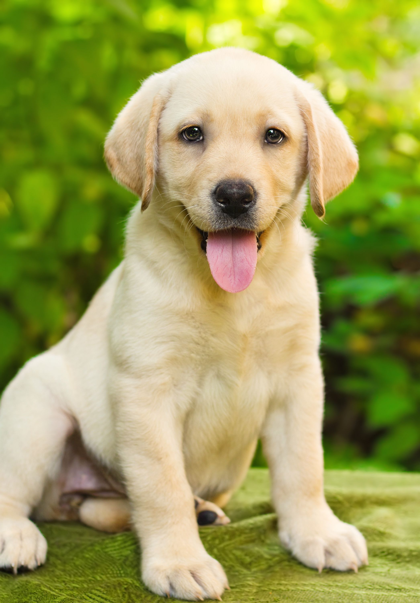

# 📽️ Image to Video Scrapping API  

---

## 📝 Description  
This project automates video generation using an image-to-video AI model. It works by generating temporary emails to register for a website that offers a free trial, allowing you to create videos from images effortlessly.  

---

## ✨ Features  
- 🎥 Convert images into AI-generated videos.  
- 🔧 Choose the format and duration of your video.  
- 📝 Add a custom prompt for each image to refine the generation.  

---

## 🖼️ Example  
#### 🐈 Let's start with a cat and a simple prompt:  
"It's a cat, make it move"    
  
  

---

#### 🐕 Now with the dog and no prompt
     
  

---

## 🙌 Thanks
Thanks for checking out this project! Feel free to reach out for any help or discussion:
📧 gregoire.woroniak@gmail.com
